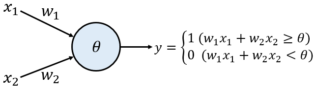
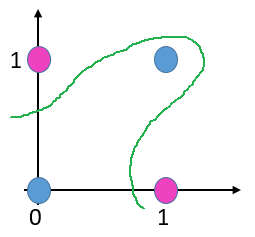
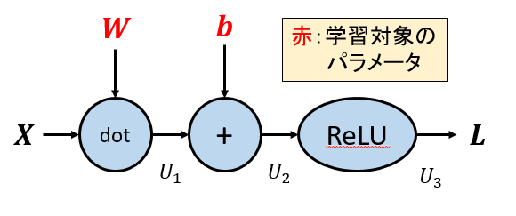
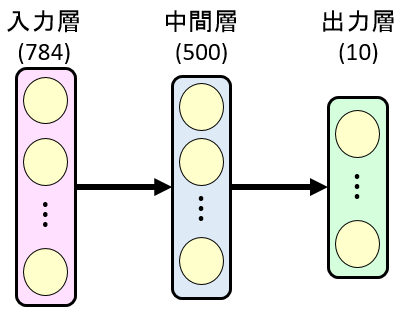

# 萩原研　プログラミング研修

**2日目：ニューラルネットワークの実装**
今週は、ディープラーニングの基礎となる順伝播型ニューラルネット（多層パーセプトロン）をPythonで実装していきます。
今日の流れはざっとこんな感じです。
1. 最初に、脳の1つのニューロンを模した **パーセプトロン** をクラスとして実装し、これを１つ１つつなげることで簡単な論理演算を行うネットワークを作ります。
2. 次に、各ユニットを層単位でまとめて管理し、行列計算を駆使して入力データを処理する **順伝播型ニューラルネットワーク** を構築します。
3. 次に、**計算グラフ** を用いて誤差逆伝播法を実装します。
4. 最後に、ニューラルネットワーク全体を学習させる機構を構築し、MNISTの数字画像を分類する簡単なネットワークを構成します。

---
## 1. パーセプトロン

最初に、脳の１個１個のニューロンをモデル化したものである **パーセプトロン**（厳密には **形式ニューロン/人工ニューロン**)を実装しましょう。

パーセプトロンは上図のように、入力の重みづけ総和を計算し、これがある閾値$\theta$を超えたら1, そうでないなら0を出力するような非常に単純なユニットです。

### 演習1-1. パーセプトロンのクラス実装
上図のような2つの入力を持つパーセプトロンを`Perceptron`クラスとして実装してください。参考として、次のように変数とメソッドを定義すると良いです。
- 変数
  - 重み変数 `w1, w2`
  - 閾値 `theta`
- メソッド
  - コンストラクタ `__init__`：各種パラメータ変数の初期化処理
  - 順伝播関数 `forward`：入力引数 `x1, x2` から出力値$y \in \{0, 1\}$を計算

### 演習1-2. 論理ゲート(AND, NAND, OR)
`Perceptron`クラスをインスタンス化し、それぞれANDゲート、NANDゲート、ORゲートとしてふるまうような3つのインスタンスを生成し、その動作を確認してください。インスタンス生成の際、それぞれ適切な重み`w1, w2`および閾値`theta`の値を各自考えてみてください。

**＜入力サンプル＞**
```
x1_list = [1, 1, 0, 0]
x2_list = [1, 0, 1, 0]
```
**＜出力例＞**
```
AND(1, 1) = 1   NAND(1, 1) = 0  OR(1, 1) = 1
AND(1, 0) = 0   NAND(1, 0) = 1  OR(1, 0) = 1
AND(0, 1) = 0   NAND(0, 1) = 1  OR(0, 1) = 1
AND(0, 0) = 0   NAND(0, 0) = 1  OR(0, 0) = 0
```

### 演習1-3. 論理ゲート(XOR)
１個のパーセプトロンでは0/1の分離境界を線形にしかできないという弱点があります。そのため、下の図から分かるようにXORゲートは１つのパーセプトロンでは実現できません。

しかし、これは複数のパーセプトロンを組み合わせることで解決できます。演習1-2で作ったAND, OR, NANDゲートをうまく組み合わせてXORゲートに相当する演算を行う関数`xor(x1, x2)`を定義し、その動作を確認してください。

**＜出力例＞**
```
XOR(1, 1) = 0
XOR(1, 0) = 1
XOR(0, 1) = 1
XOR(0, 0) = 0
```


---
## 2. 順伝播型ニューラルネットワーク

深層学習の分野において、ニューロンを層状に並べた **順伝播型ニューラルネットワーク / 多層パーセプトロン(MLP)** が最も基本的な構造になります。

1.では一つ一つのニューロンを個別に扱いましたが、ここでは「層」単位でニューロンの集まりを管理するという実装により、並列計算を生かしたより効率的な実装を目指したいと思います。
輪講でもやったように、層単位の順伝播は行列の積とelement-wise（要素ごと）の関数適用により実現できます。このような行列演算を行う上で、**numpy** という数値計算のライブラリが大変便利になります。今後は「ベクトル、行列」という数値のまとまりの単位で演算を行うことに主眼を置いていきます。

### 演習2-1. 活性化関数の定義(sigmoid)
numpyによるベクトル/行列演算の練習問題として、まず活性化関数を定義したいと思います。演習1では活性化関数として **ステップ関数** (閾値を超えたら1, そうでないなら0)を用いましたが、これは3. で勾配降下法を適用するときに勾配（微分）が常に0になってしまうため学習ができません。そこで、勾配がどこでも値を持つよう「滑らかな」関数である必要があります。
伝統的なニューラルネットの活性化関数として **sigmoid関数** が用いられてきました。
$$ sigmoid(x) = \frac{1}{1 + e^{-x}} $$ そこで、ベクトル（一次元のnumpy配列）`x`を入力とし、各要素ごとにsigmoid関数を適用した結果のベクトルを返す関数 `sigmoid(x)` を定義してください。
＜ヒント＞numpyの数学関数は基本的にデフォルトで配列の要素ごとに計算を行うことができます。

**＜入力サンプル＞**
```
x = np.array([-1.0, 0.0, 0.5, 2.0])
```
**＜出力例＞**
```
[ 0.26894142  0.5         0.62245933  0.88079708]
```

### 演習2-2. 活性化関数の定義(ReLU)
近年の深層学習で最も一般的に用いられる活性化関数は **ReLU関数** です。これは次の式で定義されます。
$$ ReLU(x) = max(0, x) $$ 演習2-1と同様にして関数`relu(x)`を定義し、先ほどの入力サンプルに対する出力を確認してください。

**＜出力例＞**
```
[ 0.   0.   0.5  2. ]
```


### 演習2-3. 「層」単位のクラス実装
それでは、入力ベクトル$\textbf{x}$に重みをかけ、バイアスを足し、ReLU活性化関数を適用するという一層の処理を行う`SingleLayer`クラスを実装してみましょう。層の出力は重み行列を$W$、バイアスを$\textbf{b}$として
$$ ReLU(W^T\textbf{x} + {b}) $$ と計算されます。変数、メソッドについては先ほどのPerceptronクラスを参考にしてください（現時点ではまだ学習のことは想定しなくても結構です）。入力ベクトル、重み、バイアスとして次の値を与えた時の動作を確認してください。

**＜入力サンプル＞**
```
x = np.array([1.0, 0.5])
W = np.array([[0.1, 0.3, 0.5], [0.2, 0.4, 0.6]])
b = np.array([0.1, 0.2, 0.3])
```

**＜出力例＞**
```
[ 0.3  0.7  1.1]
```

### 演習2-4. 多層化とバッチ処理
一層の処理ができましたので、今度はこれを多層にする＆一度に処理する入力ベクトルを１個から複数個にするという二つの方向に拡張します。
この演習では、４個の２次元ベクトルからなる[4, 2]の入力データ行列を処理する3層のニューラルネットワークを`MLP_3Layer`クラスとして実装します。メソッドについてはこれまでと同様、コンストラクタ`__init__`と順伝播計算を行う`forward`を持つものとします。入力ベクトルおよび各層の重み、バイアスとして次の値を与えた時の動作を確認してください。

**＜入力サンプル＞**
```
# 各層のユニット数は[2, 3, 2, 2]、バッチサイズは4
x = np.array([[1.0, 0.5], [-0.3, -0.2], [0.0, 0.8], [0.3, -0.4]])
W1 = np.array([[0.1, 0.3, 0.5], [0.2, 0.4, 0.6]])
b1 = np.array([0.1, 0.2, 0.3])
W2 = np.array([[0.1, 0.4], [0.2, 0.5], [0.3, 0.6]])
b2 = np.array([0.1, 0.2])
W3 = np.array([[0.1, 0.3], [0.2, 0.4]])
b3 = np.array([0.1, 0.2])
```
**＜出力例＞**
```
[[ 0.426   0.912 ]
 [ 0.1608  0.3334]
 [ 0.3528  0.752 ]
 [ 0.2016  0.4226]]

```

### 演習2-5. 出力層の設計
演習2-4で作った３層のモデルはどの層も活性化関数としてReLUを用いていました。しかし、出力層の値はタスクに応じていろいろ変えたいので、ふつう出力層は中間層とはまた別の特別な実装が必要になります。
今回はタスクとして最も一般的な **クラス分類** を想定しましょう。$K$クラスのクラス分類では、出力ユニットが$K$個あり、各出力はそれぞれのクラスの確率を表すようにするのが一般的です。このような出力を可能にする活性化関数に **softmax関数** があります。
$$ softmax(\textbf{x})_k = \frac{e^{x_k}}{\sum_{i=1}^K e^{x_i}} $$
演習2-1, 2-2と同様にしてベクトルを引数とする関数 `softmax(x)` を定義し、MLP_3Layerの3層目の活性化関数がsoftmax関数になるよう修正を加えてください。そして先ほどと同じ入力とパラメータ値を与えたときの動作を確認してください。
＜注意＞softmaxは極端に大きい値が出やすい不安定な数値演算のため、実際にはあらかじめ各入力ベクトルの最大値が0になるようにそれぞれ最大値で引いておくという前処理が必要になります。余裕があればこのことも考慮して実装してください。

**＜出力例＞**
```
[[ 0.38083632  0.61916368]
 [ 0.4569568   0.5430432 ]
 [ 0.40150456  0.59849544]
 [ 0.44497378  0.55502622]]
```
各行ベクトルの総和がちゃんと1になっていることを確認してください。

---
## 3. 計算グラフ

ここまでで入力データを順次処理していくという「順方向」の実装が出来上がりました。しかし、ニューラルネットワークの本質は出力の様子を見つつパラメータを逆算して学習してくと言う「逆方向」の実装にあります。
ニューラルネットワークの学習は **確率的勾配降下法(SGD)** という方法に基づいています。これは、最小化したい **損失関数** を各パラメータについて微分し、その微分に従いパラメータを繰り返し微調整していくというものです。このとき、ネットワークの各パラメータの微分を効率的に計算するアルゴリズムが **誤差逆伝播法** です。
誤差逆伝播法を説明する際、**計算グラフ** というものを導入するとわかりやすいです。計算グラフは、足し算や行列積といった演算をノードとして全体の計算を表現するものです。

誤差逆伝播法は微分のチェインルールに従いパラメータの微分を「逆算的に」求める方法でした。例えば、損失関数を仮に$L$としたときの上図の各パラメータ$W$の微分は次のように計算されます。
$$ \frac{\partial L}{\partial W } = \frac{\partial L}{\partial U_3} \frac{\partial U_3}{\partial U_2} \frac{\partial U_2}{\partial U_1} \frac{\partial U_1 }{\partial W} $$
このことから、各演算について個別に微分を計算し、その結果を計算グラフの末端側(損失関数側)から順次かけていくことで各パラメータの微分を計算できます。

そこで、各演算ごとに次のようなメソッドを持つクラスを定義することを考えます。
- コンストラクタ `__init__`
- 入力の順伝播計算 `forward`
  - 入力$x$から出力$z$を計算する関数$z = f(x)$を定義
- 微分値の逆伝播計算 `backprop`
  - 出力の微分値$\frac{\partial L}{\partial z}$から入力の微分値$\frac{\partial L}{\partial x}$を計算
  - $\frac{\partial L}{\partial x} = \frac{\partial L}{\partial z} \frac{\partial z}{\partial x}$


### 例題：乗算ノード(×)の実装
例題として、二つの変数の掛け算を行うノードを実装した`Multiply`クラスを実装してみます。
```
class Multiply():
    def __init__(self):
        """ 逆伝播計算に必要な変数：forwardの入力値 """
        self.x = None
        self.y = None
    def forward(self, x, y):
        """ 順伝播計算：z = x * y """
        self.x = x
        self.y = y
        z = x * y
        return z
    def backprop(self, dz):
        """ 逆伝播計算: dz/dx = y, dz/dy = x """
        dx = dz * self.y
        dy = dz * self.x
        return dx, dy
```

### 演習3-1. 加算ノード(+)の実装
乗算ノードの例を参考に、二つの変数の足し算を行うノードを実装した`Add`クラスを実装してください。また、先ほどの`Multiply`クラスと組み合わせて $(a + b) \times c$を計算する計算グラフを構築し、その順伝播と逆伝播の様子を確認してください。
**＜ヒント＞** 順伝播の式は$z = x + y$、微分の式は$dz/dx = 1, dz/dy = 1$となります。
**＜出力例＞** `a = 2, b = 3, c = 4`の場合
```
順伝播出力: 20
逆伝播出力 da: 4, db: 4, dc: 5
```

### 演習3-2. ReLUノードの実装
ReLU関数を適用するノードを実装した`ReLU`クラスを実装してください。ただし、入力`x`は一般のnumpy配列とします。
**＜出力例＞** `x = np.array([-0.5, 0.0, 1.0, 2.0])`の場合
```
順伝播出力: [-0.  0.  1.  2.]
逆伝播出力: [ 0.  0.  1.  1.]
```

### 演習3-3. Sigmoidノードの実装
Sigmoid関数を適用するノードを実装した`Softmax`クラスを実装してください。
**＜ヒント＞** 順伝播の式は$z = \frac{1}{1 - e^{-x}}$、微分の式は$dz/dx = z(1-z)$となります。
**＜出力例＞** `x = np.array([-0.5, 0.0, 1.0, 2.0])`の場合
```
順伝播出力: [ 0.37754067  0.5         0.73105858  0.88079708]
逆伝播出力: [ 0.23500371  0.25        0.19661193  0.10499359]
```

### 演習3-4. Affineノードの実装
入力$x$に重み行列$W$をかけ、それにバイアス$b$を加える一連の処理を`Affine`クラスとして実装してください。
**＜ヒント＞** 各変数のshapeは次のようになります。
- shape(x) = [バッチサイズ、入力ユニット数]
- shape(W) = [入力ユニット数、出力ユニット数]
- shape(b) = [出力ユニット数]

順伝播計算は$z = x\cdot W + b$です
逆伝播計算はそれぞれ次のようになります（ちゃんとshapeがあっていることを確認してください）
- $dL/dx = dL/dz \cdot W^T$
- $dL/dW = x^T \cdot dL/dz$
- $dL/db = dL/dz$ を行方向（バッチ方向）に総和をとったもの

**＜入力サンプル＞**
```
x = np.array([[1.0, 0.5], [-0.4, 0.1]])
W = np.array([[0.1, 0.3, 0.5], [0.2, 0.4, 0.6]])
b = np.array([0.1, 0.2, 0.3])
```

**＜出力例＞**
```
順伝播出力:
[[ 0.3   0.7   1.1 ]
 [ 0.08  0.12  0.16]]
逆伝播出力dx:
[[ 0.9  1.2]
 [ 0.9  1.2]]
逆伝播出力dw:
[[ 0.6  0.6  0.6]
 [ 0.6  0.6  0.6]]
逆伝播出力db:
[ 2.  2.  2.]
```

### 演習3-5. 出力層ノード(Softmax with Cross-Entropy)の実装
$K$クラス分類のタスクを想定する場合、損失関数はsoftmax関数の出力と教師ラベルとの交差エントロピーになります。この一連の処理を一つのノードで行う`SoftmaxCrossEntropy`クラスを定義してください。
**＜ヒント＞**
順伝播計算はsoftmaxの計算と交差エントロピーの計算の二つに分けられます。
- $y = softmax(x)$
- $L = \frac{1}{N} \sum_{i=1}^N \sum_{k=1}^K -t_{ik} \log y_{ik}$
  - 但し、$N$はバッチサイズ、tはone-hot教師ラベル(shape:$[N, K]$)

逆伝播計算は$dL/dx = y - t$と非常に単純な形になります。

**＜入力サンプル＞**
```
x = np.array([[1.0, 0.5], [-0.4, 0.1]])
t = np.array([[1.0, 0.0], [0.0, 1.0]])
```

**＜出力例＞**
```
順伝播出力:
0.47407698418010663
逆伝播出力:
[[-0.37754067  0.37754067]
 [ 0.37754067 -0.37754067]]
```

---
## 4. 全体のモデル構築

ここまでで必要なパーツはすべてそろいました。最後にこれらを組み合わせてMNISTを分類する本格的なモデルを実装してみましょう。
今回実装するモデルの概略図はこんな感じです。MNISTの一枚の画像は28x28の計784ピクセルなので入力層ユニット数は784、クラス数は10なので出力層ユニット数は10です。


### 演習4-1. NeuralNetworkクラスの定義
[784, 500, 10]のサイズを持つ2層ニューラルネットワークのクラス`NeuralNetwork`を定義してください。今回は簡単のため層数やユニット数はマジックナンバーとして決め打ちで書いてしまってもいいです。
このクラスの設計案は次のリストを参考にしてください。
- メソッド
  - `__init__(self)`
    - パラメータの初期化（パラメータはディクショナリ等の形でまとめて管理しておく）
    - 各演算ノードのインスタンス生成
  - `forward(self, x)`
    - softmaxの直前までの順伝播計算
    - 未知のデータに対する分類はこの出力を用いて行う
  - `loss(self, x, t)`
    - 入力データxと教師ラベルtを受け取り、損失関数を計算する
    - これを呼ぶことで順伝播が完了する
  - `backprop(self, x, t)`
    - 最初に中でloss関数を呼び出しておき順伝播を行っておく
    - 順伝播計算とは逆の順番に各ノードのbackpropメソッドを実行
    - Affineノードのbackpropを行う際にパラメータの勾配`dW, db`を計算しディクショナリなどに別途まとめておく。
  - `sgd(self, x, t, learning_rate)`
    - 最初に中でbackprop関数を呼び出し勾配を計算しておく
    - 全てのパラメータを確率的勾配降下法(SGD)の式に基づき更新
    - $W \leftarrow W - \epsilon \nabla W$ （$\epsilon$：学習係数）


### 演習4-2. MNISTの分類
最後に、実際のデータセットを用いてネットワークを学習させましょう。
次の学習条件を用いてモデル全体を学習させ、学習ループ100回ごとに訓練データに対する損失および正解率を表示してください。また、最後にテストデータに対する損失と正解率を表示してください。
- バッチサイズ（学習時に使用するデータ数）：100
  - 学習に使用するデータは訓練データ60000枚から毎回ランダムに100枚選択
- エポック数（データセットを何周学習させるか）：100
- 重みの初期値：ガウシアン初期化(平均0, 標準偏差0.1)
- バイアスの初期値：0
- SGDの学習係数：0.0001

なお、MNISTデータセットを読み込みプログラムとしてmnist.pyを使用しますので、これをdatasetディレクトリの下に入れてください。使い方は次の通りです。
```
# インポート
from dataset.mnist import load_mnist

# 読み込み（初回時のみダウンロードも行います）
mnist = load_mnist()

# データセットへのアクセス
mnist["train_img"]    # 訓練データ画像   [60000, 784]
mnist["train_label"]  # 訓練データラベル [60000, 10]
mnist["test_img"]     # テストデータ画像 [10000, 784]
mnist["test_label"]   # テストラベル     [10000, 10]
```

**＜出力例＞**
```
Loss 0: 3.2685531810627895
Acc: 11.0 %
Loss 100: 1.012559391954679
Acc: 73.0 %
Loss 200: 0.633419881170411
Acc: 82.0 %
...
Loss 59900: 0.06369888765762836
Acc: 97.0 %
Test Loss: 0.08527644799650203
Test Acc: 97.5 %
```
